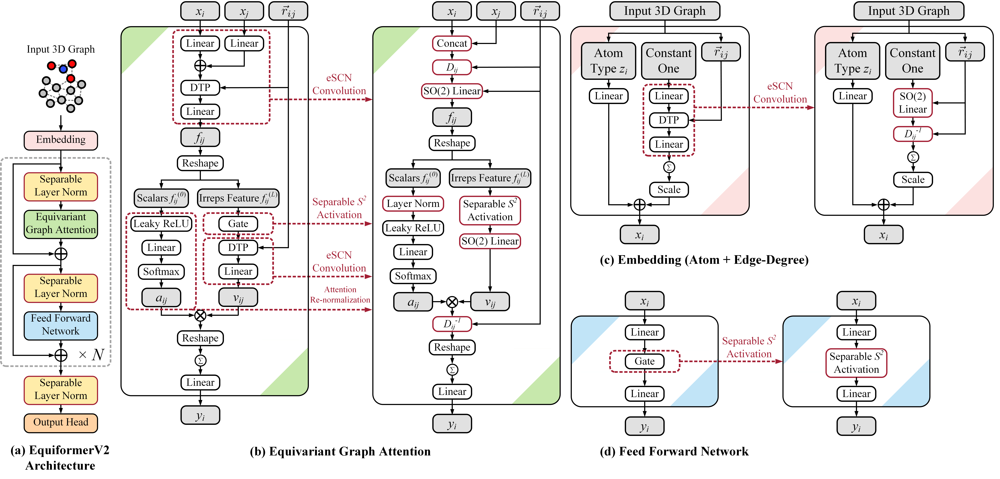
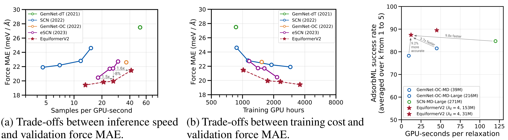
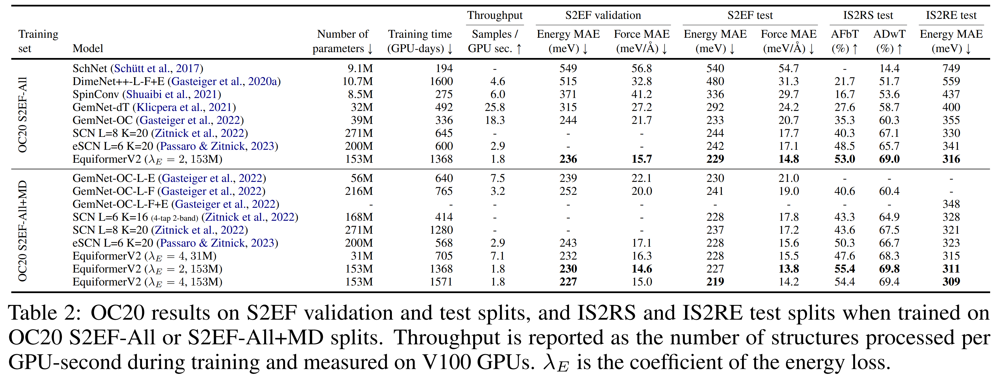
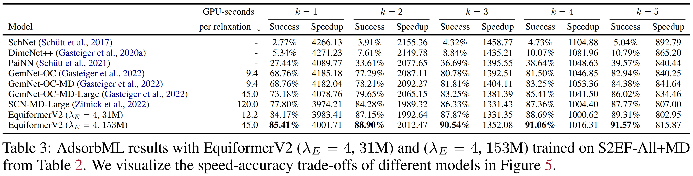
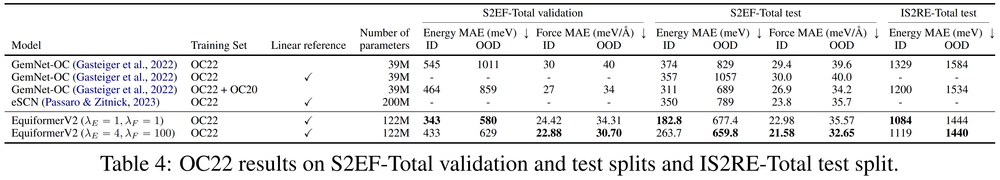

# EquiformerV2: Improved Equivariant Transformer for Scaling to Higher-Degree Representations

**[Paper](https://arxiv.org/abs/2306.12059)** | **[OpenReview](https://openreview.net/forum?id=mCOBKZmrzD)** | **[Poster](docs/equiformer_v2_poster.pdf)**

This repository contains the official PyTorch implementation of the work "EquiformerV2: Improved Equivariant Transformer for Scaling to Higher-Degree Representations" (ICLR 2024).
We provide the code for training the base model setting on the OC20 S2EF-2M and S2EF-All+MD datasets.

Additionally, EquiformerV2 has been incorporated into [OCP repository](https://github.com/FAIR-Chem/fairchem/tree/main/src/fairchem/core/models/equiformer_v2) and used in [Open Catalyst demo](https://open-catalyst.metademolab.com/).

In our subsequent [work](https://arxiv.org/abs/2403.09549), we find that we can generalize self-supervised learning similar to BERT, which we call **DeNS** (**De**noising **N**on-Equilibrium **S**tructures), to 3D atomistic systems to improve the performance of EquiformerV2 on energy and force predictions. 
Please refer to the [paper](https://arxiv.org/abs/2403.09549) and the [code](https://github.com/atomicarchitects/DeNS) for further details.


<p align="center">
	
</p>

<p align="center">
	
</p>

<p align="center">
	
</p>

<p align="center">
	
</p>

<p align="center">
	
</p>


## Content ##
0. [Environment Setup](#environment-setup)
0. [Changelog](#changelog)
0. [Training](#training)
0. [File Structure](#file-structure)
0. [Checkpoints](#checkpoints)
0. [Citation](#citation)
0. [Acknowledgement](#acknowledgement)


## Environment Setup ##


### Environment 

See [here](docs/env_setup.md) for setting up the environment.


### OC20

The OC20 S2EF dataset can be downloaded by following instructions in their [GitHub repository](https://github.com/Open-Catalyst-Project/ocp/blob/5a7738f9aa80b1a9a7e0ca15e33938b4d2557edd/DATASET.md#download-and-preprocess-the-dataset).

For example, we can download the OC20 S2EF-2M dataset by running:
```
    cd ocp
    python scripts/download_data.py --task s2ef --split "2M" --num-workers 8 --ref-energy
```
We also need to download the `"val_id"` data split to run training.

After downloading, place the datasets under `datasets/oc20/` by using `ln -s`:
```
    cd datasets
    mkdir oc20
    cd oc20
    ln -s ~/ocp/data/s2ef s2ef
```

To train on different splits like All and All+MD, we can follow the same link above to download the datasets.


## Changelog ##


Please refer to [here](docs/changelog.md).


## Training ##


### OC20

1. We train EquiformerV2 on the OC20 **S2EF-2M** dataset by running:
    
    ```bash
        sh scripts/train/oc20/s2ef/equiformer_v2/equiformer_v2_N@12_L@6_M@2_splits@2M_g@multi-nodes.sh
    ```
    The above script uses 2 nodes with 8 GPUs on each node.
    
    If there is an import error, it is possible that [`ocp/ocpmodels/common/utils.py`](https://github.com/Open-Catalyst-Project/ocp/blob/5a7738f9aa80b1a9a7e0ca15e33938b4d2557edd/ocpmodels/common/utils.py#L329) is not modified. 
    Please follow [here](docs/env_setup.md) for details.

    We can also run training on 8 GPUs on 1 node:
    ```bash
        sh scripts/train/oc20/s2ef/equiformer_v2/equiformer_v2_N@12_L@6_M@2_splits@2M_g@8.sh
    ```

2. We train **EquiformerV2 (153M)** on OC20 **S2EF-All+MD** by running:
    ```bash
        sh scripts/train/oc20/s2ef/equiformer_v2/equiformer_v2_N@20_L@6_M@3_splits@all+md_g@multi-nodes.sh
    ```
    The above script uses 16 nodes with 8 GPUs on each node.

3. We train **EquiformerV2 (31M)** on OC20 **S2EF-All+MD** by running:
    ```bash
        sh scripts/train/oc20/s2ef/equiformer_v2/equiformer_v2_N@8_L@4_M@2_splits@all+md_g@multi-nodes.sh
    ```
    The above script uses 8 nodes with 8 GPUs on each node.
    
4. We can train EquiformerV2 with **DeNS** (**De**noising **N**on-Equilibrium **S**tructures) as an auxiliary task to further improve the performance on energy and force predictions. Please refer to the [code](https://github.com/atomicarchitects/DeNS) for details.


## File Structure ##

1. [`nets`](nets) includes code of different network architectures for OC20.
2. [`scripts`](scripts) includes scripts for training models on OC20.
3. [`main_oc20.py`](main_oc20.py) is the code for training, evaluating and running relaxation.
4. [`oc20/trainer`](oc20/trainer) contains code for the force trainer as well as some utility functions.
5. [`oc20/configs`](oc20/configs) contains config files for S2EF.


## Checkpoints ##

We provide the checkpoints of EquiformerV2 trained on S2EF-2M dataset for 30 epochs, EquiformerV2 (31M) trained on S2EF-All+MD, and EquiformerV2 (153M) trained on S2EF-All+MD.
|Model	|Split	|Download	|val force MAE (meV / Å) |val energy MAE (meV) |
|---	|---	|---	|---	|---	| 
|EquiformerV2	|2M	|[checkpoint](https://dl.fbaipublicfiles.com/opencatalystproject/models/2023_06/oc20/s2ef/eq2_83M_2M.pt) \| [config](oc20/configs/s2ef/2M/equiformer_v2/equiformer_v2_N@12_L@6_M@2_epochs@30.yml)	|19.4 | 278 |
|EquiformerV2 (31M)|All+MD |[checkpoint](https://dl.fbaipublicfiles.com/opencatalystproject/models/2023_06/oc20/s2ef/eq2_31M_ec4_allmd.pt) \| [config](oc20/configs/s2ef/all_md/equiformer_v2/equiformer_v2_N@8_L@4_M@2_31M.yml) |16.3 | 232 |
|EquiformerV2 (153M) |All+MD | [checkpoint](https://dl.fbaipublicfiles.com/opencatalystproject/models/2023_06/oc20/s2ef/eq2_153M_ec4_allmd.pt) \| [config](oc20/configs/s2ef/all_md/equiformer_v2/equiformer_v2_N@20_L@6_M@3_153M.yml) |15.0 | 227 |


## Citation ##

Please consider citing the works below if this repository is helpful:

- [EquiformerV2](https://arxiv.org/abs/2306.12059):
    ```bibtex
    @inproceedings{
        equiformer_v2,
        title={{EquiformerV2: Improved Equivariant Transformer for Scaling to Higher-Degree Representations}}, 
        author={Yi-Lun Liao and Brandon Wood and Abhishek Das* and Tess Smidt*},
        booktitle={International Conference on Learning Representations (ICLR)},
        year={2024},
        url={https://openreview.net/forum?id=mCOBKZmrzD}
    }
    ```

- [eSCN](https://arxiv.org/abs/2302.03655):
    ```bibtex
    @inproceedings{
        escn,
        title={{Reducing SO(3) Convolutions to SO(2) for Efficient Equivariant GNNs}},
        author={Passaro, Saro and Zitnick, C Lawrence},
        booktitle={International Conference on Machine Learning (ICML)},
        year={2023}
    }
    ```

- [Equiformer](https://arxiv.org/abs/2206.11990):
    ```bibtex
    @inproceedings{
        equiformer,
        title={{Equiformer: Equivariant Graph Attention Transformer for 3D Atomistic Graphs}},
        author={Yi-Lun Liao and Tess Smidt},
        booktitle={International Conference on Learning Representations (ICLR)},
        year={2023},
        url={https://openreview.net/forum?id=KwmPfARgOTD}
    }
    ```

- [OC20 dataset](https://arxiv.org/abs/2010.09990):
    ```bibtex
    @article{
        oc20,
        author = {Chanussot*, Lowik and Das*, Abhishek and Goyal*, Siddharth and Lavril*, Thibaut and Shuaibi*, Muhammed and Riviere, Morgane and Tran, Kevin and Heras-Domingo, Javier and Ho, Caleb and Hu, Weihua and Palizhati, Aini and Sriram, Anuroop and Wood, Brandon and Yoon, Junwoong and Parikh, Devi and Zitnick, C. Lawrence and Ulissi, Zachary},
        title = {{Open Catalyst 2020 (OC20) Dataset and Community Challenges}},
        journal = {ACS Catalysis},
        year = {2021},
        doi = {10.1021/acscatal.0c04525},
    }
    ```

Please direct questions to Yi-Lun Liao (ylliao@mit.edu).


## Acknowledgement ##

Our implementation is based on [PyTorch](https://pytorch.org/), [PyG](https://pytorch-geometric.readthedocs.io/en/latest/index.html), [e3nn](https://github.com/e3nn/e3nn), [timm](https://github.com/huggingface/pytorch-image-models), [ocp](https://github.com/Open-Catalyst-Project/ocp), [Equiformer](https://github.com/atomicarchitects/equiformer).